# TemplateUI

A set of templated controls.

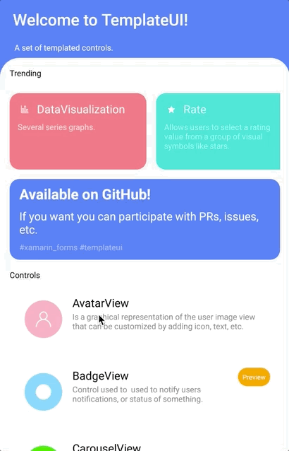

Supported platforms:
* Android
* iOS
* macOS
* UWP
  
_What is a templated control?_

It is a control defined by a template. Every control has a **ControlTemplate** property and can modify the structure that defines the control.
  
## Usage

**Step 1**: Add a reference to TemplateUI. 

**NOTE:** Currently TemplateUI is not yet available in NuGet. _But... why?_. There are a couple more controls and some fixes almost ready. After merge and polish details, TemplateUI will be in NuGet.

**Step 2**: Initialize TemplateUI in your shared library:

`TemplateUI.Init();`

**Step 3**: Enjoy coding!.

## Overview

Let's see the possibilities of TemplateUI.

#### Controls

The **controls** available are:

### AvatarView

Is a graphical representation of the user image view that can be customized by adding icon, text, etc.

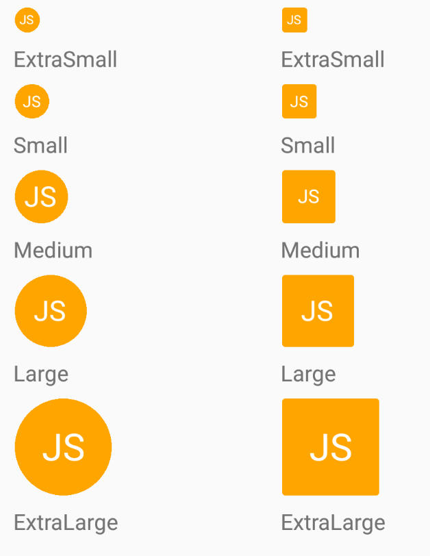

### BadgeView

Control used to  used to notify users notifications, or status of something.

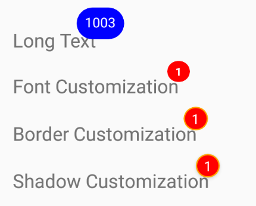

### CarouselView

Allow to navigate through a collection of views.

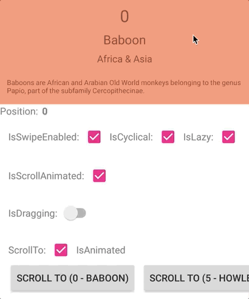

### ChatBubble

Allow to show a speech bubble message.

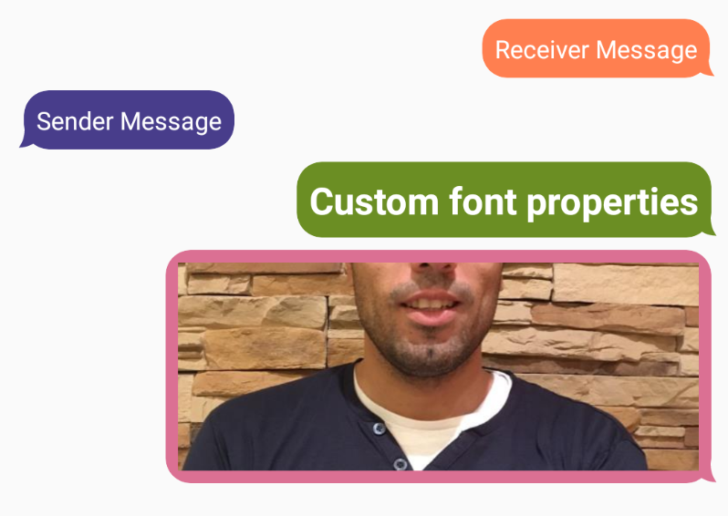

### CircleProgressBar

Shows a control that indicates the progress percentage of an on-going operation by circular shape.

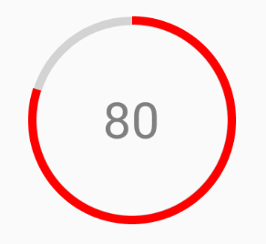

### ComparerView

Provides an option for displaying a split-screen of two views, which can help you to make comparisons.

### DataVisualization

Several series graphs.

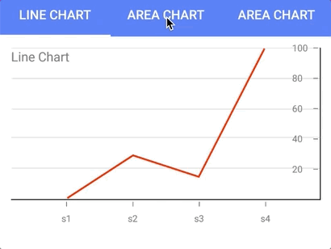

### Divider

Displays a separator between views.

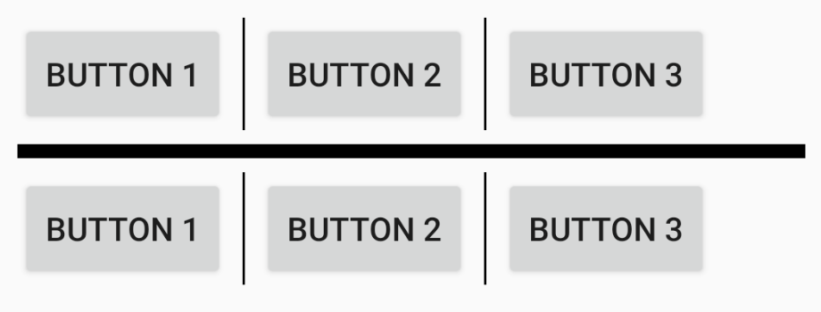

### GridSplitter

Represents the control that redistributes space between columns or rows of a Grid control.

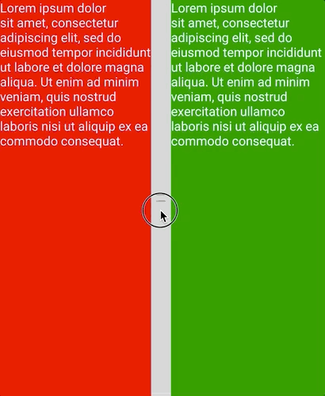

### Marquee

Use this control to add an attention–getting text message that scrolls continuously across the screen.

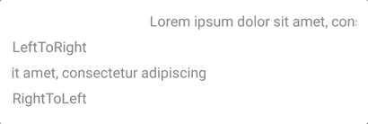

### ProgressBar

Represents progress as a horizontal bar that is filled to a percentage represented by a float value.

### Rate

Allows users to select a rating value from a group of visual symbols like stars.

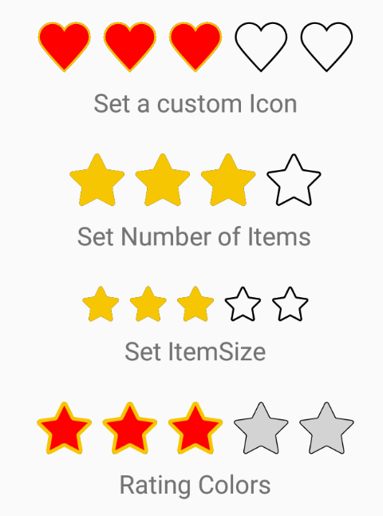

### SegmentedControl

Is a linear segment made up of multiple segments and allow users to select between multiple options.

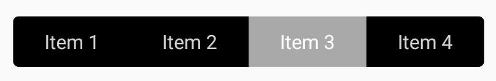

### Shield

Shield is a type of badge.

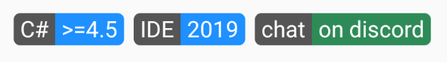

### Slider

Is a horizontal bar that can be manipulated by the user to select a double value from a continuous range.

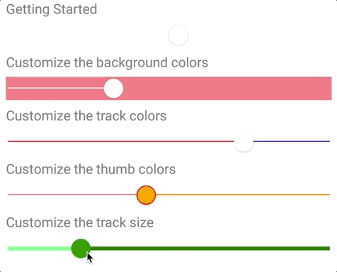

### SnackBar

Provide brief messages about app processes at the bottom of the screen.

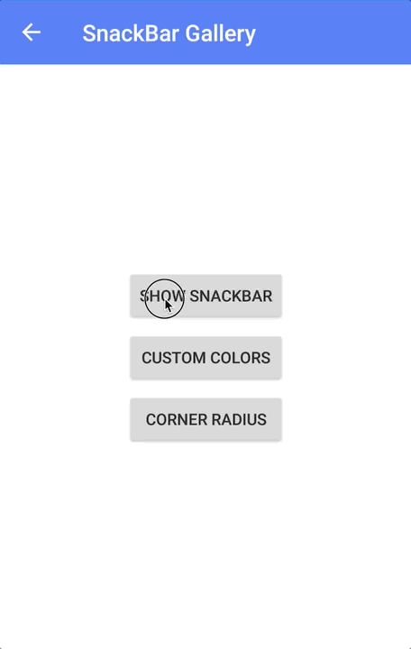

### Tag

Is a tagging control.

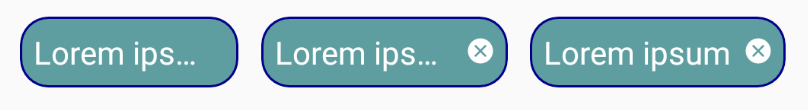

### ToggleSwitch

A View control that provides a toggled value.

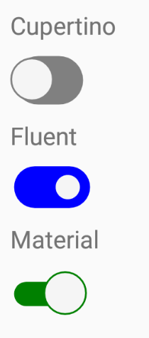

### TreeView

Enables a hierarchical list with expanding and collapsing nodes that contain nested items.

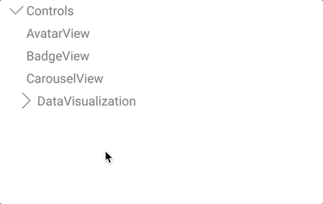

#### Layouts

But ... isn't this a templated controls library? You are right. But to create certain controls, there are layouts that would help to achieve the desired result. For example, in the list of upcoming controls we have a Clock. To position the elements that make up the Clock, a CircularLayout makes things very simple.

These Layouts, in addition to adding more possibilities to the library, help to create more templated controls.

The **layouts** available are:

### CircularLayout

The CircularLayout is a simple Layout derivative that lays out its children in a circular arrangement. 
It has some useful properties to allow some customization like the Orientation (Clockwise or Counterclockwise).

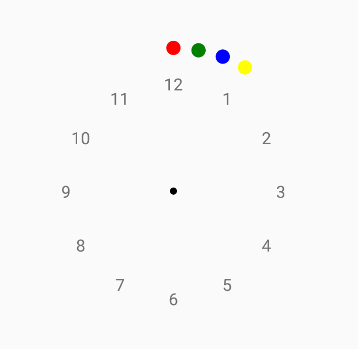

### DockLayout

The DockLayout makes it easy to dock content in all four directions (top, bottom, left and right). 
This makes it a great choice in many situations, where you want to divide the screen into specific areas, 
especially because by default, the last element inside the DockLayout, unless this feature is specifically disabled, 
will automatically fill the rest of the space (center).

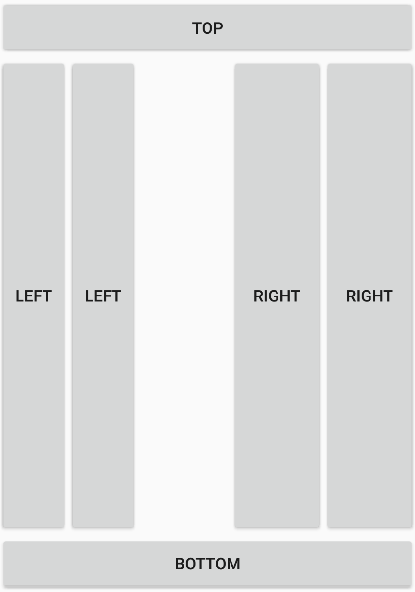

### HexLayout

A Layout that arranges the elements in a honeycomb pattern.

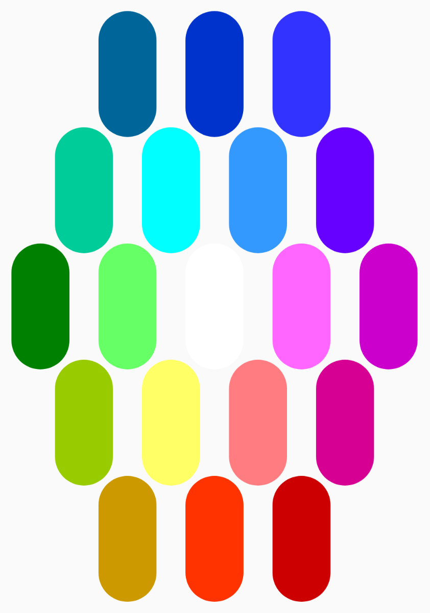

## Contribute

Do you want to contribute?.

**Found a Bug?**

If you find a bug, you can help me by submitting an [issue](https://github.com/jsuarezruiz/TemplateUI/issues). Even better, you can submit a [Pull Request](https://github.com/jsuarezruiz/TemplateUI/pulls) with a fix.

**Submitting a pull request**

For every contribution, you must:
- Test your code.
- target master branch (or an appropriate release branch if appropriate for a bug fix).

**Adding documentation**

To update the documentation, you must submit a  Pull Request adding or updating the existing markdowns.

## Feedback or Requests

Use GitHub [Issues](https://github.com/jsuarezruiz/TemplateUI/issues) for bug reports and feature requests.

## Principles

* Principle #1: Kept TemplateUI simple.
* Principle #2: Any control added must allow customization using the ControlTemplate property.

## Known Issues

* A lot of the controls are made up of basic shapes. Gestures don't work with Shapes on iOS. This affects some control like Rate. (waiting [PR #11419](https://github.com/xamarin/Xamarin.Forms/pull/11419))

## What's next

The next controls will be:
* Clock
* TabView

In addition, there are ideas for a wide variety of controls like:
* Calendar
* ColorPicker
* DataGrid
* Horizontal Calendar
* Loading
* Pagination
* StepBar
* TimeBar

And much more!

## Copyright and license

Code released under the [MIT license](https://opensource.org/licenses/MIT).